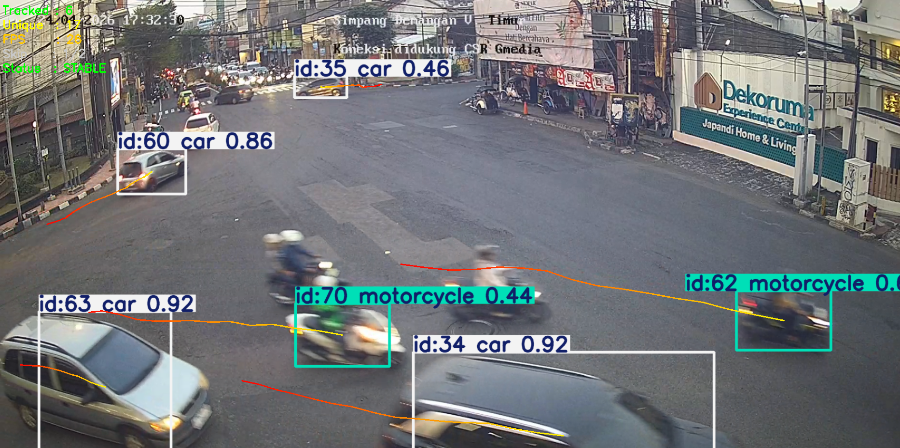
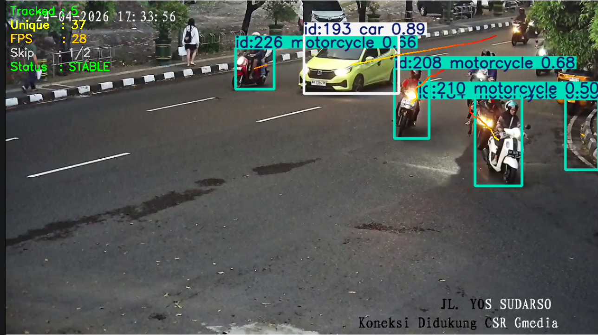
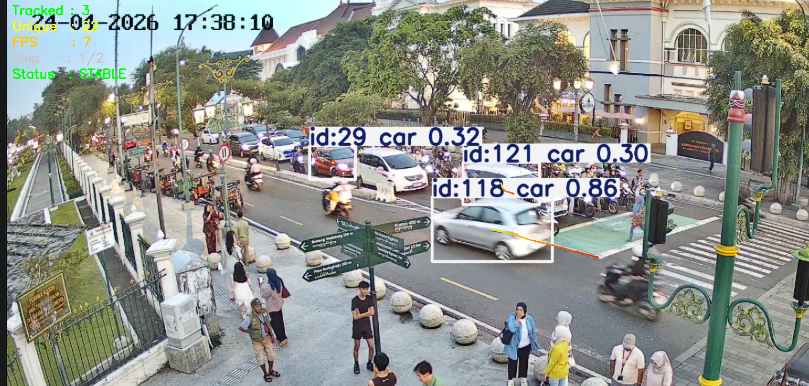
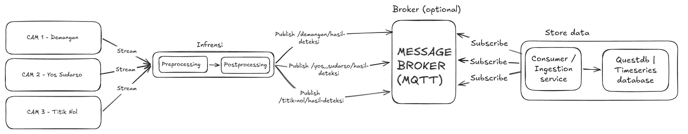

# 🚦 Yogyakarta Intelligent Traffic Monitoring System (YITMS)

<div align="center">


**Sistem monitoring dan analitik lalu lintas real-time berbasis Computer Vision**  
menggunakan public CCTV Kota Yogyakarta · YOLO Tracking · MQTT · Streamlit

</div>

---

## 🎬 Demo Prototype

> Preview sistem inferensi berjalan secara real-time pada stream CCTV publik Kota Yogyakarta.


---

## Dashboard

[Open Live Dashboard](https://yogyakarta-intelligent-traffic-monitoring-system.streamlit.app)

## 📖 Tentang Project

YITMS adalah sistem open-source yang memadukan **Computer Vision** dan **Data Analytics** untuk memantau kepadatan lalu lintas secara real-time di titik-titik strategis Kota Yogyakarta. Data deteksi dikirim via MQTT dan divisualisasikan melalui dashboard interaktif berbasis Streamlit.

Project ini dirancang sebagai **referensi open-source** yang bisa dipelajari, dikembangkan, dan dikontribusikan oleh siapapun.

### Fitur Utama

| Fitur | Detail |
|-------|--------|
| 🎯 **Real-time Detection** | YOLO tracking pada stream HLS public CCTV Jogjakota |
| 🚗 **Multi-class** | Motor, Mobil, Bus/Truk, dan Sepeda |
| 📡 **MQTT Publishing** | Payload JSON dikirim ke broker setiap kendaraan baru terdeteksi |
| 🐳 **Dockerized** | 4 inference container siap deploy secara bersamaan |
| 📊 **Analytics Dashboard** | Visualisasi interaktif filter by tanggal, jam, lokasi |
| 🔄 **Auto-reconnect** | Stream HLS reconnect otomatis saat putus |

---

## 🛣️ Lokasi Pengamatan

Sistem ini mengambil data dari **3 titik CCTV publik** di Kota Yogyakarta:

### 📍 Simpang Demangan



> **cam1** · `ATCS_Simpang_Demangan_View_Timur` · MQTT topic: `/demangan/hasil_deteksi`

---

### 📍 Jl. Yos Sudarso



> **cam3** · `ANPR-Jl-Yos-Sudarso` · MQTT topic: `/yos_sudarso/hasil_deteksi`

---

### 📍 Titik Nol Kilometer



> **cam4** · `NolKm_Timur` · MQTT topic: `/titik_nol/hasil_deteksi`

---

## 🔄 Pipeline Inferensi

Berikut adalah alur lengkap dari pengambilan data CCTV hingga penyimpanan ke database:



### Penjelasan Tiap Tahap

| Tahap | Komponen | Keterangan |
|-------|----------|------------|
| **Stream** | HLS / m3u8 | Baca frame dari CCTV public Jogjakota via `cv2.VideoCapture` |
| **Preprocessing** | `StreamReader` | Frame dibaca di background thread, resize untuk efisiensi inferensi |
| **Postprocessing** | YOLO + ByteTrack | Deteksi objek, tracking ID, filter `MIN_TRACK_AGE` untuk eliminasi noise |
| **Publish** | `paho-mqtt` | Payload JSON dikirim ke MQTT broker setiap ada track baru yang dikonfirmasi |
| **Broker** | Mosquitto (opsional) | Message broker sebagai perantara antara inference dan storage |
| **Consumer** | Ingestion service | Subscribe MQTT → parse → simpan ke database *(komponen terpisah)* |
| **Database** | QuestDB / Timeseries | Penyimpanan data time-series deteksi *(komponen terpisah)* |

> 💡 **Catatan:** Komponen *Consumer/Ingestion* dan *Database* tidak disertakan di repo ini. Di project ini, data disimpan dalam format CSV yang tersedia di folder `data/`.

---

## 📂 Struktur Repository

```
yitms/
│
├── inference/                  # Computer Vision inference scripts
│   ├── cam1-demangan.py        # CCTV Simpang Demangan
│   ├── cam3-yos-sudarso.py
│   ├── cam4-titiknol.py
│   ├── Dockerfile
│   ├── docker-compose.yml
│   ├── requirements.txt
│   ├── start.sh
│   └── stop.sh
│
├── dashboard/
│   └── app.py                  # Streamlit analytics dashboard
│
├── notebooks/
│   └── olahdata.ipynb          # Eksplorasi & preprocessing data
│
├── data/
│   ├── data_cctv_clean_v1.csv  # Dataset bersih (181K rows)
│   ├── data_kotor.csv          # Raw data sebelum cleaning
│   └── sample_data.csv         # Sample 500 baris untuk demo
│
├── asset/                      # Media dokumentasi
│   ├── preview.mp4
│   ├── pipeline-infrensi.png
│   ├── demangan.png
│   ├── yos_sudarso.png
│   └── titik_nol.png
│
├── models/                     # Letakkan model .pt di sini (di-.gitignore)
├── .gitignore
├── requirements.txt
└── README.md
```

---

## ⚙️ Cara Setup

### Prasyarat

- Python 3.10+
- Docker & Docker Compose
- NVIDIA GPU opsional (CPU tetap bisa, tapi lebih lambat)
- MQTT Broker (Mosquitto) jika ingin full pipeline

### 1. Clone Repository

```bash
git clone https://github.com/PaulD4vd/YITMS-Yogyakarta-Intelligent-Traffic-Monitoring-System-.git
cd YITMS-Yogyakarta-Intelligent-Traffic-Monitoring-System-
```

### 2. Analytics Dashboard

```bash
pip install -r requirements.txt
streamlit run dashboard/app.py
```

Dashboard terbuka di `http://localhost:8501` — dataset sudah tersedia di `data/`.

### 3. Inference Engine (Docker)

#### Siapkan model

```bash
# Letakkan model YOLO dan tracker config di folder models/
cp /path/to/yolo26n.pt models/
cp /path/to/custom_bytetrack.yaml models/---

---
```

> Bisa juga pakai model standar `yolov8n.pt` dari Ultralytics sebagai alternatif.

#### Konfigurasi MQTT

Edit IP broker di `inference/cam*.py` (atau gunakan env var):

```python
MQTT_BROKER = "192.168.1.99"   # Ganti dengan IP broker kamu
```

#### Deploy

```bash
cd inference/
docker compose up -d --build
docker compose logs -f
```

#### Tanpa Docker (local)

```bash
pip install -r inference/requirements.txt

export MODEL_PATH=/path/to/models/yolo26n.pt
export TRACKER_PATH=/path/to/models/custom_bytetrack.yaml

python inference/cam1-demangan.py
```

---

## 📡 Format Payload MQTT

```json
{
  "camera_id": "cam1",
  "timestamp": "2026-03-25 07:23:41",
  "new_tracks": [
    { "object": "motor",  "track_id": 42 },
    { "object": "mobil",  "track_id": 43 }
  ]
}
```

---

## 📈 Format Dataset CSV

| Kolom | Tipe | Contoh |
|-------|------|--------|
| `camera_id` | string | `cam1`, `cam3`, `cam4` |
| `object` | string | `motor`, `mobil`, `bus_truk`, `sepeda` |
| `track_id` | int | `12345` |
| `detection_timestamp` | datetime (UTC) | `2026-03-25 07:23:41` |
| `created_at` | datetime | `2026-03-25 20:14:22` |
| `location` | string | `demangan`, `yos_sudarso`, `titik_nol` |


## 📄 Lisensi

[MIT License](LICENSE) — bebas digunakan, dimodifikasi, dan didistribusikan.

---

## 🙏 Acknowledgements

- [Ultralytics YOLO](https://github.com/ultralytics/ultralytics)
- [Streamlit](https://streamlit.io)
- [CCTV Jogjakota](https://cctvjss.jogjakota.go.id)
- [Eclipse Paho MQTT](https://github.com/eclipse/paho.mqtt.python)
- [Plotly](https://plotly.com/python/)

---

<div align="center">
pauldaviddjukardi@gmail.com
</div>
